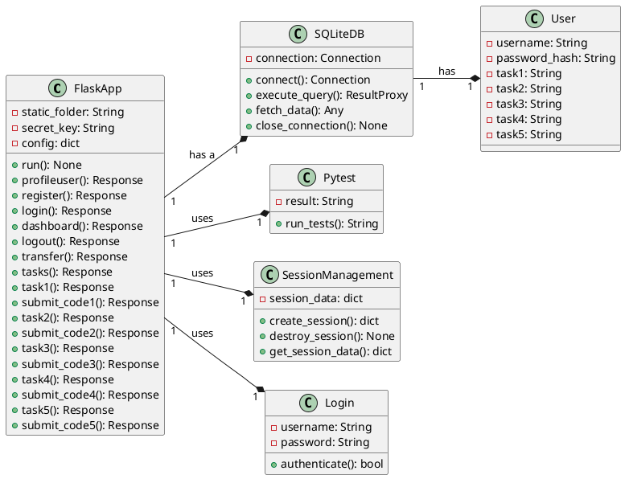

```plantuml
@startuml
left to right direction

class FlaskApp {
    - static_folder: String
    - secret_key: String
    - config: dict
    + run(): None
    + profileuser(): Response
    + register(): Response
    + login(): Response
    + dashboard(): Response
    + logout(): Response
    + transfer(): Response
    + tasks(): Response
    + task1(): Response
    + submit_code1(): Response
    + task2(): Response
    + submit_code2(): Response
    + task3(): Response
    + submit_code3(): Response
    + task4(): Response
    + submit_code4(): Response
    + task5(): Response
    + submit_code5(): Response
}

class SQLiteDB {
    - connection: Connection
    + connect(): Connection
    + execute_query(): ResultProxy
    + fetch_data(): Any
    + close_connection(): None
}

class Pytest {
    - result: String
    + run_tests(): String
}

class SessionManagement {
    - session_data: dict
    + create_session(): dict
    + destroy_session(): None
    + get_session_data(): dict
}

class Login {
    - username: String
    - password: String
    + authenticate(): bool
}

class User {
    - username: String
    - password_hash: String
    - task1: String
    - task2: String
    - task3: String
    - task4: String
    - task5: String
}

FlaskApp "1" --* "1" SQLiteDB: has a
FlaskApp "1" --* "1" Pytest: uses
FlaskApp "1" --* "1" SessionManagement: uses
FlaskApp "1" --* "1" Login: uses
SQLiteDB "1" --* "1" User: has
@enduml
```